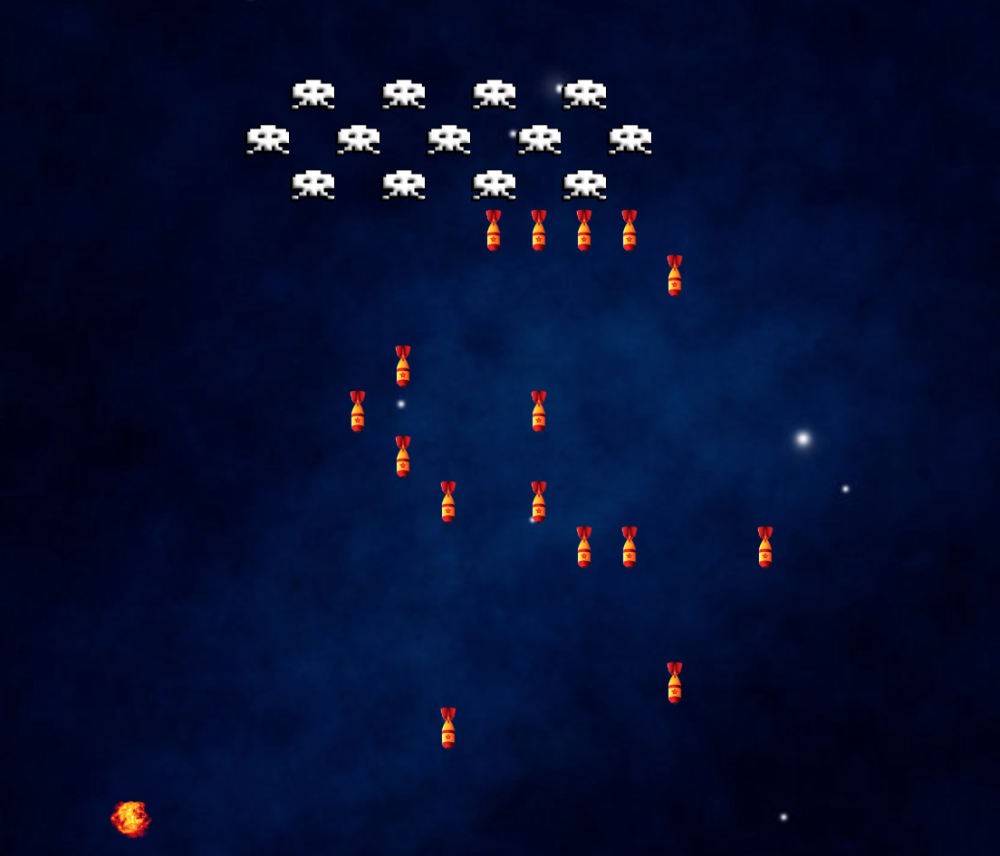

# sei-project-1
# Space Invaders - GA SEI-41 P1 Write Up
---

### Goal: to recreate the classic arcade game, Space Invaders.

### Technology used: JavaScript, CSS, HTML, GitHub

### Timeframe: 7 Days

---
## My Game

Following the classic format for Space Invaders, the player controls a defensive cannon, aiming to shoot down the invading force before it reaches the bottom of the screen. The defensive cannon can move from right to left only, the invasion force moves across the screen in each direction, advancing down the screen by one line when it reaches the edge of the screen.

### Controls

Movement: Left and Right arrow keys
Firing: S-button
Start game/Level Up: Start Button
Pause game: Stop Button
Restart: Reset Button

### Game Instructions

This is a single screen game, with the user arriving at the site to see the introduction, Start, Stop and Reset buttons, and the scoreboard.

Pressing Start will initiate the aliens and their firing logic, using the arrows will cause the player’s token to appear. It will also cause the text within the Start button to change to ‘Level Up!’

The player must then shoot down as many of the invasion force as possible - each hit earns 500 points, while each time the player is hit the life counter to the left adjusts accordingly.

When either all aliens have been defeated or the player is out of lives, an alert runs, prompting the player to play again.

## Process
I began by creating my grid-layout in JavaScript, starting with a simple 10x10 grid that I could expand later. Using some basic images for a single alien and the player, I started working on the movement logic. Once this was working satisfactorily, I introduced further aliens, and then missiles (fired by the player) and bombs (dropped by the aliens).

Each alien is created as part of a class, pushing each alien to an array of aliens.

The class includes the functions for movement and dropping a bomb. I was also able to adapt this for both bomb and missile construction, which push to respective arrays of  bombs or missiles.

Part of this class includes a boolean for movingRight and a counter for movement, alienCount. Each alien should count the squares it has moved across the screen, moving to the line below and reversing direction when the appropriate count has been reached (grid width less the width of the alien squadron). Due to initially starting with an individual alien, then moving to class constructor, the movement remains buggy depending on the number of aliens within the squad (see Challenges).

[image:E1F2C7BF-860F-4E7B-B16C-64421A9A6C77-44910-000171C2F564CED8/4A23EBEA-B7D3-4AE0-B506-405F2525987B.png]

When the fire functions run, they initiate a ‘checkPlayerHit’  or ‘checkHit’ function to determine if the player or alien has been hit,  or if the bomb has reached the bottom row, updating the display and points counter as appropriate.

The bomb and missile classes are added to the screen in relation to a randomly selected alien:

However progressing further in the game shows an additional bug: dead aliens are still included in the potential shooters array, despite including a condition to remove them (!aliens.alienhit). This is related to the issue with movement - see Challenges.

Both player and alien check hit functions work by checking the classList of the containing square - by the time I added in the class of ‘boom’ to show a detonated bomb or missile, my familiarity with the limitations around class and timer had increased significantly and implementation was significantly easier than managing the class construction for aliens or player.

## Challenges
While I encountered several smaller problems throughout the build process, I have identified the following two as the key points to address.

### Timers, constructors and scope
### 1 - background
I began my construction within the init (after the DOM had loaded). Having identified issues with aliens moving independently early on, I switched to a class constructor for the aliens.

### 1 - symptoms
The initiators and timers for alien movement and firing remain within the init, while the class Aliens is outside. Due to scoping issues, the movement and bomb-drop logic does not handle a change in alien numbers well. This manifests as follows:
	1: the boolean movingRight is reset for the entire class by each alien. If there is an even number of aliens, the boolean ends on the same value as it started.
	2: killed aliens are forgotten when this takes effect (only noticeable when >30%  of aliens are killed), meaning bombs can be dropped from the last position of dead aliens, though they are no longer visible.

### 1 - proposed solution
Timers and logic to move to the class constructor. I began experimenting with this on day 5 of the project. While moving the movement logic to the alien class was relatively simple, this manifested problems with timers and scope which I did not have time to see this through before submission.

---

### Timers pt 2
### 2 - background
The player begins the game by clicking start. This begins a timer on the bomb drop and alien movement logic. Each subsequent click causes an additional timer to start, increasing the speed of alien movement and the frequency of bomb drops.

### 2 - symptoms
Aliens speed and fire rate increases with each subsequent click of the start button. After this, stop will cancel out the additional timers but no longer pauses the game.

[image:D7A7E159-0DAC-4334-9320-38ECE2FB1C57-44910-0001739064D98070/1CA08D6C-32B7-4B9C-96CC-20C5B5DDCB40.png]

### 2 - proposed solution
My temporary fix was to change the text within the start button to ‘Level Up!’ incorporating the glitch as a feature I was planning to include for future development. I believe this issue of multiple timer-starts will be solved by including the movement and fire timers into the class construction however ran out of time before I could confirm this was true.

## Wins
A huge win for me was building the game from scratch, pushing the limits of everything I had learned so far. My familiarity with class constructors, scope, and timers has improved significantly throughout this project.

Having reached a minimum viable product by end of day 5 allowed me to spend the majority of day 6 on styling and user experience. Having struggled getting to grips with CSS earlier in the course, I intentionally kept the styling comparatively simple. My main aim was to stay true to the original concept: simple layouts with classic arcade-style fonts and bright colours.

I was also much more content with manipulating my code towards the end of the project,  and was particularly happy with the speed and comfortability with which I created my scoreboard which I believe shows marked progression from my first few lines of code.

## Future Features
The priority task would be to fix the above mentioned bugs. Beyond that, I would like to add in a leaderboard using local storage and sound effects for firing.
Other tweaks and additions
	- adding sound
	- adding ‘cover’ for the player as per classic Space Invaders . This would need to be destroyable by alien bombs/player missiles. Alternatively I would need to include a check in the alien’s firing logic for clear squares beneath them (this would also benefit the scale-ability, meaning only aliens on the lowest rank would be able to fire)
	- update the win/loss actions to a more engaging screen. Include an option to reset on lose and level up on win
	- add a 2 player mode
